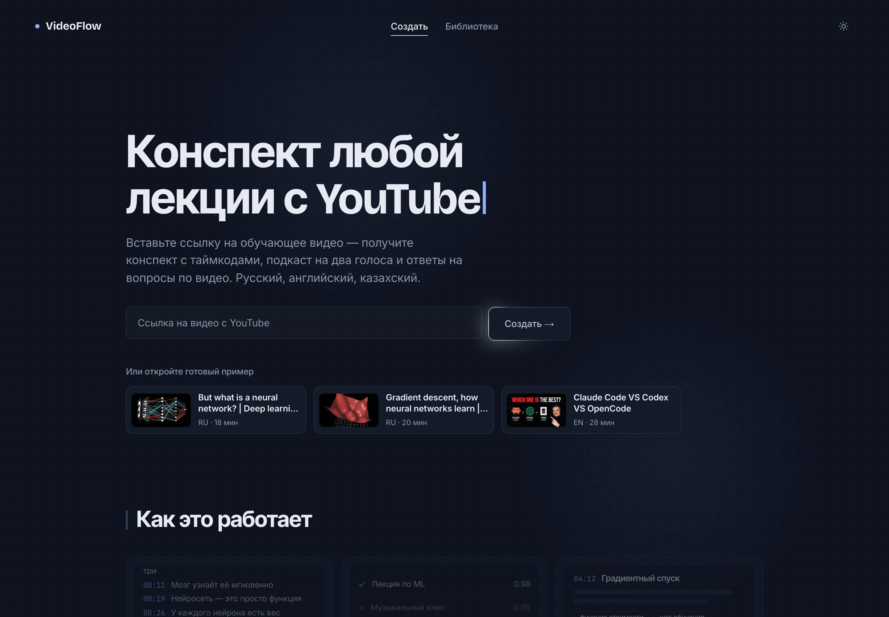
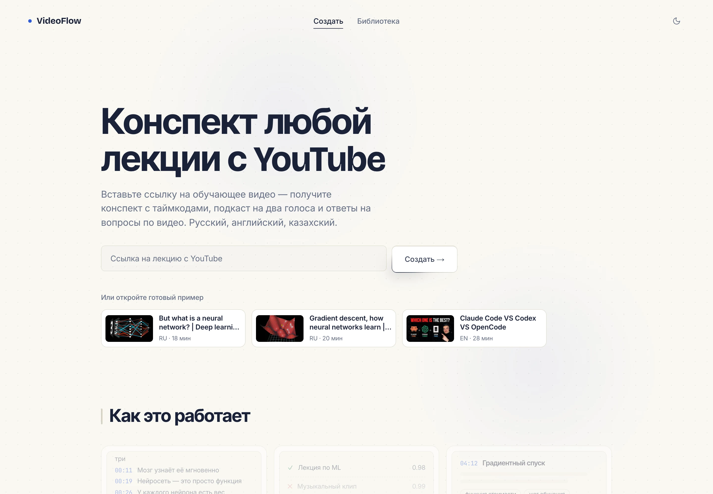
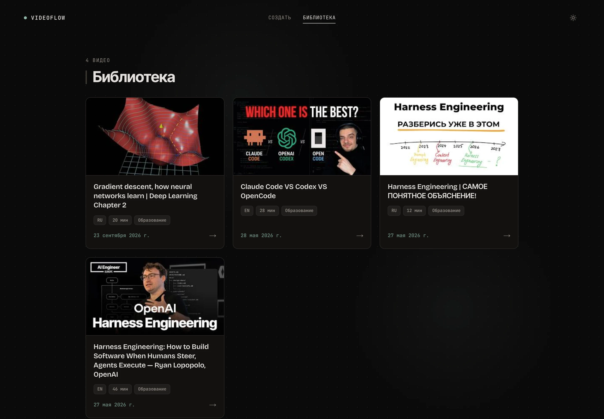
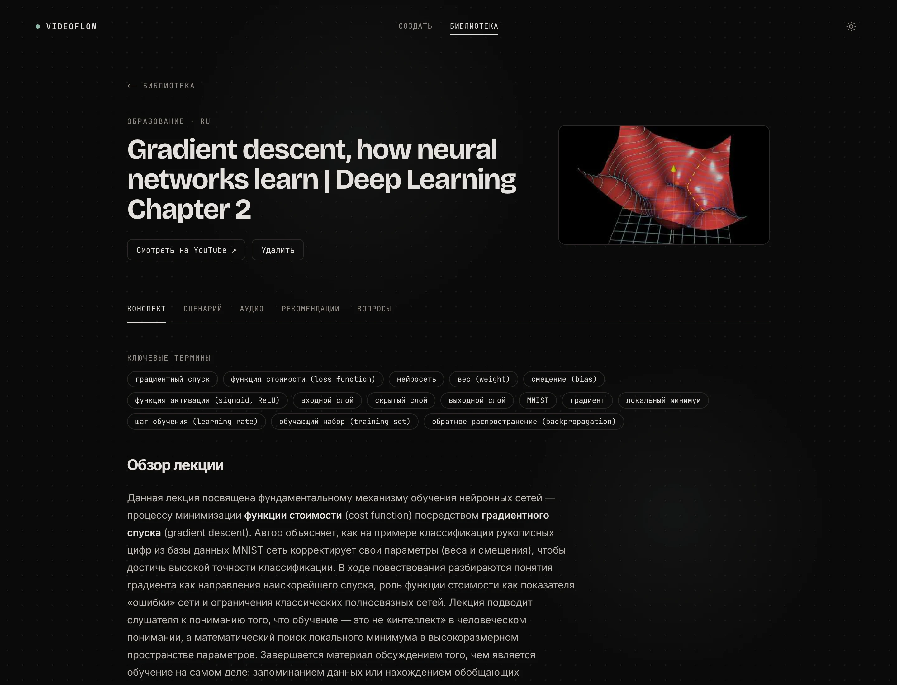
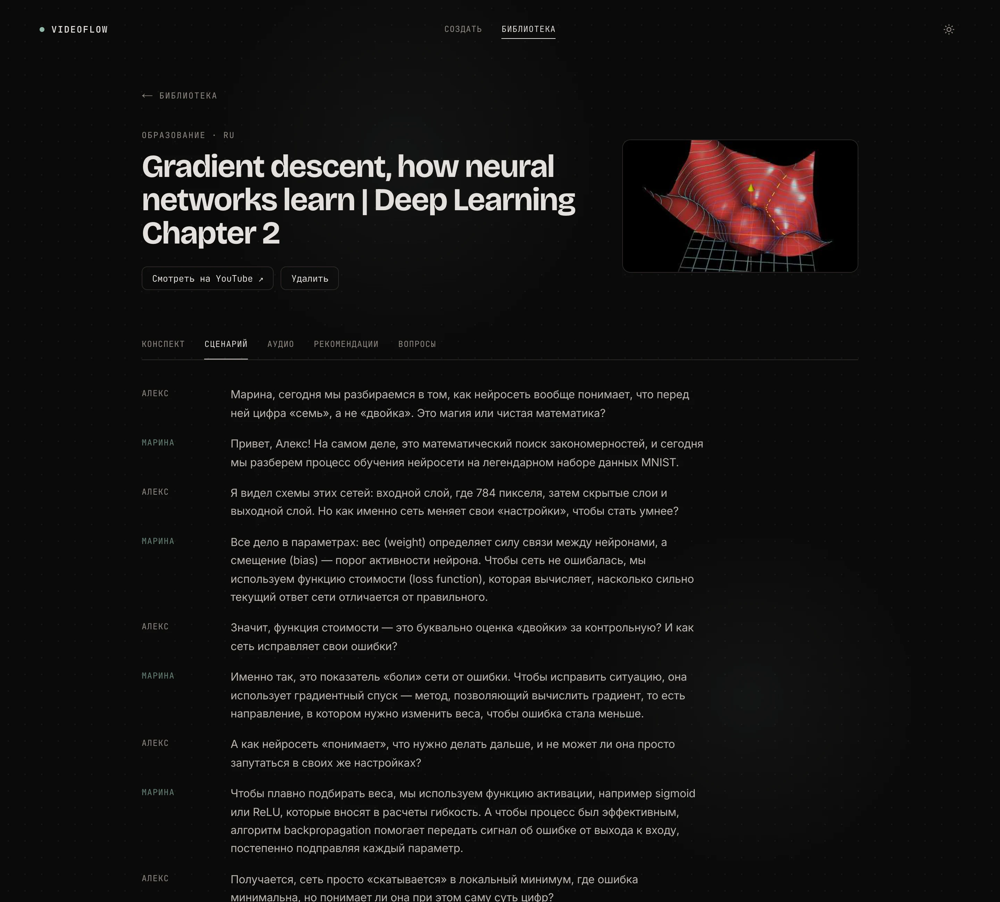
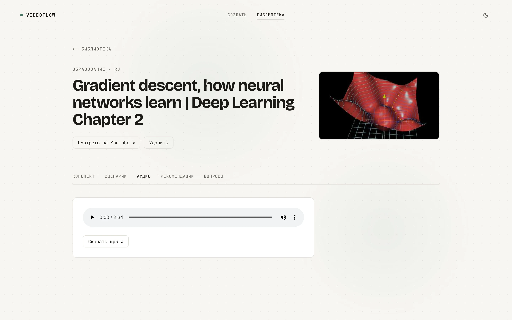

# 🎙️ VideoFlow — AI Podcast Creator

**VideoFlow** — мультиагентная система на базе LangGraph, которая превращает образовательные YouTube-видео в конспекты и подкасты. Система извлекает транскрипт, отсеивает необучающий контент, пишет подробный конспект с таймкодами, сценарий диалога двух ведущих, озвучивает его и отвечает на вопросы по видео через RAG (Retrieval-Augmented Generation).



---

## 📋 Оглавление

- [Возможности](#-возможности)
- [Скриншоты](#-скриншоты)
- [Архитектура](#-архитектура)
- [Технологический стек](#-технологический-стек)
- [Структура проекта](#-структура-проекта)
- [Установка и запуск](#-установка-и-запуск)
  - [Docker](#docker)
  - [Локальный запуск](#локальный-запуск)
- [Переменные окружения](#-переменные-окружения)
- [API документация](#-api-документация)
- [Мультиагентный пайплайн](#-мультиагентный-пайплайн)
- [RAG система](#-rag-система-вопрос-ответ)
- [Интерфейс](#-интерфейс)

---

## ✨ Возможности

| Функция | Описание |
|---|---|
| 🎬 **Извлечение транскрипта** | Субтитры YouTube-видео на русском, английском и казахском |
| 🔍 **Классификация контента** | ИИ пропускает только обучающие видео — клипы, влоги и новости отклоняются с причиной |
| 📝 **Конспект** | Разделы с таймкодами, глоссарий, главные выводы и вопросы для самопроверки |
| 🔑 **Ключевые термины** | 10–15 основных терминов, отсортированных по важности |
| 🎙️ **Сценарий подкаста** | Диалог двух ведущих (Алекс и Марина), каждую версию проверяет редактор-критик |
| 🔊 **Аудио** | Озвучка двумя голосами через ElevenLabs |
| 💬 **Вопросы по видео** | RAG с гибридным поиском (ChromaDB + BM25), ответы со ссылками на моменты видео |
| 🎯 **Рекомендации** | Онлайн-курсы и книги по теме через Tavily Search |
| 💾 **Мгновенный кэш** | Видео хранятся бессрочно; повторная ссылка на то же видео в любом формате отдаётся из базы без запросов к YouTube и LLM |
| 🌓 **Веб-интерфейс** | Next.js, тёмная и светлая тема, анимации |

---

## 📸 Скриншоты

<table>
  <tr>
    <td></td>
    <td></td>
  </tr>
  <tr>
    <td align="center">Главная — тёмная тема</td>
    <td align="center">Главная — светлая тема</td>
  </tr>
  <tr>
    <td></td>
    <td></td>
  </tr>
  <tr>
    <td align="center">Библиотека</td>
    <td align="center">Конспект с ключевыми терминами</td>
  </tr>
  <tr>
    <td></td>
    <td></td>
  </tr>
  <tr>
    <td align="center">Сценарий подкаста</td>
    <td align="center">Аудио — светлая тема</td>
  </tr>
</table>

---

## 🏗️ Архитектура

```
┌─────────────────┐     ┌─────────────────┐     ┌─────────────────┐
│   Next.js (web) │────▶│   FastAPI (API)  │────▶│   LangGraph     │
│   (порт 3000)   │◀────│   (порт 8000)    │◀────│   (Агенты)      │
└─────────────────┘     └────────┬────────┘     └────────┬────────┘
                                 │                       │
                    ┌────────────┼────────────┐          │
                    │            │            │          │
               ┌────▼─────┐ ┌────▼───┐  ┌─────▼────┐ ┌───▼──────────┐
               │PostgreSQL│ │ChromaDB│  │ElevenLabs│ │ LLM (Gemini, │
               │  (Кэш)   │ │(Вектор)│  │ (Аудио)  │ │ Groq gpt-oss)│
               └──────────┘ └────────┘  └──────────┘ └──────────────┘
```

Браузер обращается только к Next.js: запросы `/api/*` проксируются в FastAPI, поэтому CORS не нужен, а адрес API задаётся переменной `API_URL` при запуске.

### Граф агентов (LangGraph)

```
START
  │
  ▼
cache_node ──┬──▶ END                    (видео уже в базе, аудио не нужно)
             ├──▶ audio ──▶ END          (видео уже в базе, нужно аудио)
             ▼
extract_transcript
  │
  ▼
classify ──▶ reject ──▶ END              (не обучающее видео)
  │
  ▼
start_pipeline ──┬──▶ summarize ──┐
                 ├──▶ keywords  ──┴──▶ merge ──▶ script ◀──┐
                 └──▶ rag_index ──▶ END           │        │ повтор, макс. 2
                                                  ▼        │
                                               critic ─────┘
                                                  │
                                                  ▼
                                             save_to_db ──┬──▶ audio ──▶ END
                                                          └──▶ END (skip_audio)
```

---

## 🛠️ Технологический стек

| Компонент | Технология |
|---|---|
| **Оркестрация агентов** | LangGraph (StateGraph) |
| **LLM** | Google Gemini 3.1 Flash Lite (конспект, сценарий, ответы), Groq `openai/gpt-oss-120b` (термины, критик), `openai/gpt-oss-20b` (классификатор) |
| **Векторная БД** | ChromaDB + HuggingFace Embeddings (`paraphrase-multilingual-MiniLM-L12-v2`) |
| **Гибридный поиск** | ChromaDB (семантический) + BM25 (лексический) + Reciprocal Rank Fusion |
| **Генерация аудио** | ElevenLabs API (`eleven_multilingual_v2`) |
| **Веб-поиск** | Tavily Search API |
| **База данных** | PostgreSQL (SQLAlchemy ORM) |
| **API** | FastAPI |
| **Интерфейс** | Next.js 16 (App Router), React 19, react-markdown |
| **Контейнеризация** | Docker + Docker Compose |

---

## 📁 Структура проекта

```
youtube-flow/
├── backend/                          # Python: FastAPI + LangGraph
│   ├── app/
│   │   ├── agent/
│   │   │   ├── agent.py              # Ноды агентов (cache, extract, classify, summarize, script, critic, audio, recommend…)
│   │   │   ├── agent_node.py         # Граф LangGraph — связи между нодами
│   │   │   ├── agent_state.py        # GraphState (TypedDict) + инициализация LLM
│   │   │   └── chat_agent/rag.py     # RAG: индексация, гибридный поиск, QA-цепочка
│   │   ├── api/api.py                # FastAPI — REST endpoints
│   │   ├── db/
│   │   │   ├── database.py           # SQLAlchemy модели
│   │   │   └── cache.py              # Чтение/запись/удаление кэша
│   │   └── tools/
│   │       ├── youtube_scraper.py    # Извлечение транскрипта с YouTube
│   │       ├── chunking_transcript.py # Разбивка транскрипта на чанки с таймкодами
│   │       └── audio_generator.py    # Двухголосое аудио через ElevenLabs
│   ├── tests/test_cache_first.py     # Проверка: обработанное видео отдаётся из кэша
│   ├── Dockerfile                    # Образ API
│   └── requirements.txt
├── frontend/                         # Next.js интерфейс
│   ├── app/
│   │   ├── page.tsx                  # Главная: ввод ссылки, «Как это работает»
│   │   ├── library/page.tsx          # Библиотека
│   │   ├── videos/[id]/page.tsx      # Страница видео
│   │   ├── api/[...path]/route.ts    # Прокси /api/* → FastAPI
│   │   ├── header.tsx                # Навигация и переключатель темы
│   │   └── globals.css               # Темы, типографика, анимации
│   ├── lib/api.ts                    # Типы и клиент API
│   └── Dockerfile
├── docs/screenshots/                 # Скриншоты для README
├── docker-compose.yml                # db + api + web
├── .env.example                      # Шаблон переменных окружения
└── README.md
```

---

## 🚀 Установка и запуск

### Docker

```bash
git clone https://github.com/BektassovAlisher/youtube-flow.git
cd youtube-flow
cp .env.example .env   # заполните ключи API
docker compose up -d --build
```

После запуска:
- **Интерфейс:** [http://localhost:3000](http://localhost:3000)
- **API:** [http://localhost:8000](http://localhost:8000)
- **Swagger:** [http://localhost:8000/docs](http://localhost:8000/docs)
- **PostgreSQL:** `localhost:5435`

Остановка: `docker compose down` (с удалением данных — `docker compose down -v`).

### Локальный запуск

Нужны Python 3.11+, Node.js 20+, PostgreSQL 15+ и ffmpeg.

1. **Виртуальное окружение и зависимости:**
```bash
python -m venv venv
source venv/bin/activate  # macOS/Linux
pip install -r backend/requirements.txt
```

2. **Переменные окружения:**
```bash
cp .env.example .env
```

3. **База данных** — своя (`createdb lecture_agent`) или из Docker: `docker compose up -d db` (порт `5435`, как в `.env.example`).

4. **API:**
```bash
cd backend/app
uvicorn api.api:app --host 0.0.0.0 --port 8000 --reload
```

5. **Интерфейс** (в отдельном терминале):
```bash
cd frontend
npm install
npm run dev
```
По умолчанию он обращается к API на `http://127.0.0.1:8000`; адрес меняется переменной `API_URL`.

6. **Откройте** [http://localhost:3000](http://localhost:3000)

**Проверка кэша** (без внешних API, на временной SQLite):
```bash
venv/bin/python backend/tests/test_cache_first.py
```

---

## 🔐 Переменные окружения

Файл `.env` в корне проекта (шаблон — `.env.example`):

| Переменная | Описание | Обязательно |
|---|---|---|
| `DATABASE_URL` | URL подключения к PostgreSQL | ✅ |
| `GOOGLE_API_KEY` | API ключ Google Gemini | ✅ |
| `GROQ_API_KEY` | API ключ Groq (модели gpt-oss) | ✅ |
| `ELEVENLABS_API_KEY` | API ключ ElevenLabs (аудио) | ✅ |
| `TAVILY_API_KEY` | API ключ Tavily (рекомендации) | ✅ |
| `DB_PASSWORD` | Пароль PostgreSQL (для Docker) | 🐳 |
| `API_URL` | Адрес FastAPI для интерфейса (в Docker — `http://api:8000`) | — |

---

## 📡 API документация

| Метод | Путь | Описание |
|---|---|---|
| `POST` | `/generate` | Обработка видео по ссылке YouTube (из кэша, если уже обработано) |
| `GET` | `/videos` | Список видео: название, язык, длительность, категория, дата добавления |
| `GET` | `/videos/{video_id}` | Конспект, термины, сценарий видео |
| `DELETE` | `/videos/{video_id}` | Удаление видео, его материалов и индекса |
| `POST` | `/videos/{video_id}/qa` | Вопрос по видео (RAG) |
| `POST` | `/videos/{video_id}/recommend` | Курсы и книги по теме |
| `POST` | `/videos/{video_id}/audio` | Сгенерировать аудио |
| `GET` | `/videos/{video_id}/audio` | Получить mp3 |
| `GET` | `/health` | Проверка статуса API |

### Примеры запросов

**Обработка видео:**
```bash
curl -X POST http://localhost:8000/generate \
  -H "Content-Type: application/json" \
  -d '{"video_url": "https://www.youtube.com/watch?v=VIDEO_ID", "skip_audio": true}'
```

**Вопрос по видео:**
```bash
curl -X POST http://localhost:8000/videos/VIDEO_ID/qa \
  -H "Content-Type: application/json" \
  -d '{"question": "О чём это видео?"}'
```

**Рекомендации:**
```bash
curl -X POST http://localhost:8000/videos/VIDEO_ID/recommend
```

---

## 🤖 Мультиагентный пайплайн

Пайплайн построен на **LangGraph StateGraph**:

### 1. 💾 Cache Node
Достаёт `video_id` из ссылки (любой формат — `watch?v=`, `youtu.be/`, `shorts/`, с таймкодом) и ищет видео в PostgreSQL. Если оно уже обработано — сразу возвращает результат, без запросов к YouTube и LLM. Видео хранятся бессрочно.

### 2. 🎬 Extract Transcript
Извлекает транскрипт через `youtube-transcript-api` (русский, английский, казахский) и название видео.

### 3. 🔍 Classify
Классифицирует видео: `educational`, `entertainment`, `news`, `music`, `gaming`, `random`. Пропускает только образовательный контент (confidence ≥ 0.6).

### 4. 📝 Summarize
Подробный конспект с разделами, таймкодами, глоссарием и вопросами для самопроверки.

### 5. 🔑 Keywords
10–15 ключевых терминов из транскрипта.

### 6. 🎙️ Script
Сценарий диалога двух ведущих (Алекс — новичок, Марина — эксперт).

### 7. ✅ Critic
Проверяет формат сценария и использование ключевых терминов; может вернуть его на доработку (максимум 2 попытки).

### 8. 🔊 Audio
Двухголосый подкаст через ElevenLabs — сразу или позже по кнопке в интерфейсе.

### 9. 🧠 RAG Index
Индексирует транскрипт в ChromaDB параллельно с конспектом — только для новых видео, прошедших классификацию.

### 10. 🎯 Recommend
Курсы и книги через Tavily Search — по запросу (`/videos/{id}/recommend`), результат кэшируется.

---

## 💬 RAG система (Вопрос-Ответ)

**Гибридный поиск** для точных ответов:

1. **Семантический поиск** — ChromaDB с эмбеддингами `paraphrase-multilingual-MiniLM-L12-v2`
2. **Лексический поиск** — BM25 для точного совпадения терминов
3. **Reciprocal Rank Fusion** — объединение результатов

Каждый ответ содержит таймкоды и ссылки на нужные моменты видео.

---

## 🖥️ Интерфейс

Интерфейс написан на **Next.js** (`frontend/`): Bricolage Grotesque и Inter Tight в заголовках, Inter в тексте, JetBrains Mono в подписях.

### Создать
- Словесный знак с эффектом печати, ввод ссылки и таймер обработки
- Кнопка «Создать»: пока ссылки нет — по краю бежит светлый «хвост», при нажатии — волна от точки клика
- «Как это работает» — карточки с живыми превью результата каждого шага
- Отклонённые классификатором видео показываются с причиной

### Библиотека
- Карточки видео с превью, языком, длительностью и датой добавления

### Страница видео
- Вкладки: Конспект → Сценарий → Аудио → Рекомендации → Вопросы
- Таймкоды в конспекте и ответах ведут на нужный момент видео
- Готовые подсказки вопросов, плеер и скачивание mp3, удаление видео

### Темы
- Тёмная и светлая тема; при переключении новая тема раскрывается кругом от кнопки
- Выбор сохраняется; при первом визите берётся тема системы
- Анимации отключаются, если в системе включено «уменьшить движение»

---

## 📄 Лицензия

Этот проект создан в образовательных целях.

---

## 👤 Автор
- Alisher Manetti
